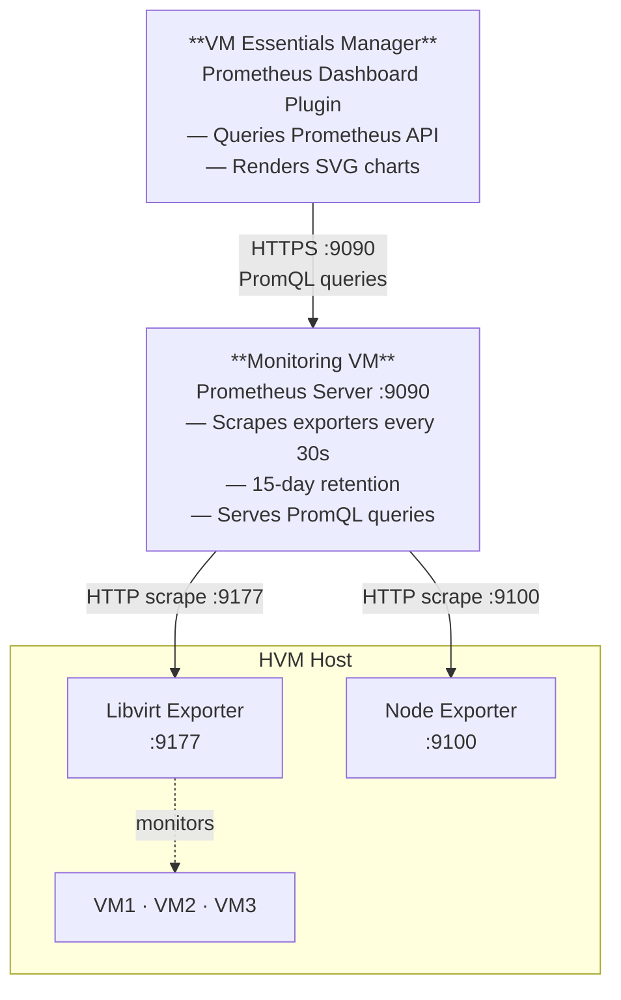

# Installation Guide — Prometheus Dashboard Plugin

This guide covers the full end-to-end setup: deploying the Prometheus monitoring stack on your KVM infrastructure, then installing and configuring the VME Manager plugin.

---

## Table of Contents

1. [Required Components](#required-components)
2. [Deployment Options](#deployment-options)
3. [Network Requirements](#network-requirements)
4. [Step 1 — Prepare the System](#step-1--prepare-the-system)
5. [Step 2 — Install Prometheus Server](#step-2--install-prometheus-server)
6. [Step 3 — Install Node Exporter](#step-3--install-node-exporter-on-each-hvm-host)
7. [Step 4 — Install Libvirt Exporter](#step-4--install-libvirt-exporter-on-each-hvm-host)
8. [Step 5 — Configure Authentication](#step-5--configure-authentication-optional)
9. [Step 6 — Install the VME Manager Plugin](#step-6--install-the-vme-manager-plugin)
10. [Step 7 — Configure the Plugin](#step-7--configure-the-plugin)
11. [Step 8 — Verify on the Dashboard](#step-8--verify-on-the-dashboard)
12. [Maintenance](#maintenance)
13. [Troubleshooting](#troubleshooting)
14. [Security Considerations](#security-considerations)
15. [References](#references)

---

## Required Components

| Component                       | Purpose                                                                    | Default Port |
| ------------------------------- | -------------------------------------------------------------------------- | ------------ |
| **Prometheus Server**           | Time-series database and PromQL query engine                               | 9090         |
| **Prometheus Libvirt Exporter** | Collects KVM/libvirt VM metrics (CPU, memory, storage, network, block I/O) | 9177         |
| **Prometheus Node Exporter**    | Collects host system metrics (CPU, memory, disk, network)                  | 9100         |
| **VME Manager Plugin JAR**      | Renders metrics on the Morpheus home dashboard                             | —            |

---

## Deployment Options

### Option A — Dedicated Monitoring VM (Recommended)

Deploy all Prometheus components on a separate VM dedicated to monitoring.

**Advantages:** isolated from production workloads, can monitor multiple hypervisor hosts, easier maintenance and backup, no performance impact on guests.

**Recommended VM Specifications:**

| Resource | Minimum                                  | Recommended      |
| -------- | ---------------------------------------- | ---------------- |
| vCPU     | 2 cores                                  | 4 cores          |
| Memory   | 4 GB                                     | 8 GB             |
| Storage  | 100 GB                                   | 250+ GB          |
| OS       | Ubuntu 20.04/22.04/24.04 LTS or RHEL 8/9 | Ubuntu 24.04 LTS |
| Network  | 1 Gbps                                   | 1 Gbps           |

> Storage grows over time. With default 15-day retention and 10,000 samples/sec, expect ~26 GB.

### Option B — HVM Host Installation

Install Prometheus components directly on the hypervisor host OS.

**Advantages:** no extra VM needed, direct access to libvirt socket, lower collection latency.

**Estimated resource overhead per host:**

| Component         | CPU (idle) | CPU (active) | Memory    |
| ----------------- | ---------- | ------------ | --------- |
| Prometheus Server | 0.5–1%     | 2–5%         | 1–2 GB    |
| Libvirt Exporter  | 0.1–0.3%   | 0.5–1%       | 50–100 MB |
| Node Exporter     | 0.05–0.1%  | 0.2–0.5%     | 30–50 MB  |

> On hosts with fewer than 8 cores or less than 32 GB RAM, consider Option A.

### Deployment Topology



---

## Step 1 — Prepare the System

```bash
# Update system packages
sudo apt update && sudo apt upgrade -y

# Install required dependencies
sudo apt install -y wget curl tar

# Create a dedicated prometheus user
sudo useradd --no-create-home --shell /bin/false prometheus
```

---

## Step 2 — Install Prometheus Server

```bash
# Download Prometheus (check for latest version)
cd /tmp
wget https://github.com/prometheus/prometheus/releases/download/v2.53.0/prometheus-2.53.0.linux-amd64.tar.gz

# Extract and install
tar -xvf prometheus-2.53.0.linux-amd64.tar.gz
sudo mv prometheus-2.53.0.linux-amd64/prometheus /usr/local/bin/
sudo mv prometheus-2.53.0.linux-amd64/promtool /usr/local/bin/

# Create directories
sudo mkdir -p /etc/prometheus /var/lib/prometheus

# Create configuration file
sudo tee /etc/prometheus/prometheus.yml > /dev/null <<EOF
global:
  scrape_interval: 30s
  evaluation_interval: 30s

scrape_configs:
  - job_name: 'prometheus'
    static_configs:
      - targets: ['localhost:9090']

  - job_name: 'hvm-libvirt'
    static_configs:
      - targets:
          - '10.42.192.11:9177'  # HVM Host 1

  - job_name: 'hvm-os'
    static_configs:
      - targets:
          - '10.42.192.11:9100'  # HVM Host 1

EOF

# Set permissions
sudo chown -R prometheus:prometheus /etc/prometheus /var/lib/prometheus

# Create systemd service
sudo tee /etc/systemd/system/prometheus.service > /dev/null <<EOF
[Unit]
Description=Prometheus Time Series Collection and Processing Server
Wants=network-online.target
After=network-online.target

[Service]
User=prometheus
Group=prometheus
Type=simple
ExecStart=/usr/local/bin/prometheus \\
  --config.file=/etc/prometheus/prometheus.yml \\
  --storage.tsdb.path=/var/lib/prometheus/ \\
  --web.console.templates=/etc/prometheus/consoles \\
  --web.console.libraries=/etc/prometheus/console_libraries \\
  --storage.tsdb.retention.time=15d \\
  --web.enable-lifecycle

Restart=always
RestartSec=5

[Install]
WantedBy=multi-user.target
EOF

# Start and enable Prometheus
sudo systemctl daemon-reload
sudo systemctl start prometheus
sudo systemctl enable prometheus
sudo systemctl status prometheus
```

**Verify:** Access `http://<monitoring-vm-ip>:9090` in a web browser.

---

## Step 3 — Install Node Exporter (on each HVM host)

```bash
# Download Node Exporter
cd /tmp
wget https://github.com/prometheus/node_exporter/releases/download/v1.8.1/node_exporter-1.8.1.linux-amd64.tar.gz

# Extract and install
tar -xvf node_exporter-1.8.1.linux-amd64.tar.gz
sudo mv node_exporter-1.8.1.linux-amd64/node_exporter /usr/local/bin/

# Create systemd service
sudo tee /etc/systemd/system/node_exporter.service > /dev/null <<EOF
[Unit]
Description=Prometheus Node Exporter
Wants=network-online.target
After=network-online.target

[Service]
User=prometheus
Group=prometheus
Type=simple
ExecStart=/usr/local/bin/node_exporter \\
  --collector.systemd \\
  --collector.processes

Restart=always
RestartSec=5

[Install]
WantedBy=multi-user.target
EOF

# Start and enable Node Exporter
sudo systemctl daemon-reload
sudo systemctl start node_exporter
sudo systemctl enable node_exporter
sudo systemctl status node_exporter
```

**Verify:** Access `http://<hvm-host-ip>:9100/metrics` to see exported metrics.

---

## Step 4 — Install Libvirt Exporter (on each HVM host)

```bash
# Download Libvirt Exporter
cd /tmp
wget https://github.com/inovex/prometheus-libvirt-exporter/releases/download/v2.4.0/prometheus-libvirt-exporter_2.4.0_linux_amd64.tar.gz

# Extract and install
tar -xvf prometheus-libvirt-exporter_2.4.0_linux_amd64.tar.gz
chmod +x prometheus-libvirt-exporter
sudo mv prometheus-libvirt-exporter /usr/local/bin/libvirt_exporter

# Create systemd service
sudo tee /etc/systemd/system/libvirt_exporter.service > /dev/null <<EOF
[Unit]
Description=Prometheus Libvirt Exporter
Wants=network-online.target
After=network-online.target libvirtd.service

[Service]
User=root
Group=root
Type=simple
ExecStart=/usr/local/bin/libvirt_exporter \\
  --web.listen-address=:9177 \\
  --libvirt.uri=qemu:///system

Restart=always
RestartSec=5

[Install]
WantedBy=multi-user.target
EOF

# Start and enable Libvirt Exporter
sudo systemctl daemon-reload
sudo systemctl start libvirt_exporter
sudo systemctl enable libvirt_exporter
sudo systemctl status libvirt_exporter
```

**Verify:** Access `http://<hvm-host-ip>:9177/metrics` to see libvirt metrics.

**Note:** Libvirt exporter requires root access to query libvirt socket (`/var/run/libvirt/libvirt-sock`).

---

## Step 5 — Configure Authentication (Optional)

By default, Prometheus has no authentication. For production environments, add basic auth:

```bash
# Install Apache utils for htpasswd
sudo apt install -y apache2-utils

# Create password file
sudo htpasswd -c /etc/prometheus/.htpasswd admin

# Update Prometheus configuration to require auth
# (Add reverse proxy like nginx or use Prometheus web.yml config)
```

Refer to Prometheus documentation for detailed authentication setup.

---

## Step 6 — Verify the Prometheus Stack

Before installing the plugin, confirm the monitoring stack is healthy.

**Check exporter targets** — open `http://<monitoring-vm-ip>:9090/targets` and ensure all targets show **UP**:

- `hvm-libvirt` job: all HVM hosts on port 9177
- `hvm-os` job: all HVM hosts on port 9100

**Run test queries** — navigate to `http://<monitoring-vm-ip>:9090/graph` and verify these return data:

```promql
libvirt_domain_info_cpu_time_seconds_total
node_cpu_seconds_total
node_memory_MemTotal_bytes
```

---

## Step 7 — Install the VME Manager Plugin

1. Log into VME Manager (Morpheus) as an administrator.
2. Navigate to **Administration → Plugins**.
3. Click **+ Add Plugin** (top right).
4. Select the plugin JAR file (`morpheus-prometheus-dashboard-plugin-<version>-all.jar`) and confirm the upload.
5. The plugin appears in the list as **Prometheus Dashboard** — toggle it to **Enabled** if not already active.

No appliance restart is required.

---

## Step 8 — Configure the Plugin

1. Click on **Prometheus Dashboard** in the plugins list to open its settings.
2. Fill in the fields and click **Save**.

| Setting                | Description                                   | Example             |
| ---------------------- | --------------------------------------------- | ------------------- |
| Prometheus Host        | IP or hostname of your Prometheus server      | `10.56.74.136`      |
| Prometheus Port        | Prometheus HTTP port                          | `9090`              |
| Prometheus Username    | Basic auth username (leave blank if disabled) | `admin`             |
| Prometheus Password    | Basic auth password                           | —                   |
| Node Exporter Instance | `host:port` of the Node Exporter target       | `10.54.159.50:9100` |
| Node Exporter Job Name | Prometheus job label for Node Exporter        | `hvm-os`            |

> Settings take effect immediately — no restart required.

---

## Step 9 — Verify on the Dashboard

1. Navigate to the **home dashboard** (house icon in the left nav).
2. The Prometheus metrics widget should span the full width of the dashboard grid.
3. Use the **1h / 6h / 12h / 1d** buttons to switch time ranges.
4. Confirm host stat cards and VM charts all display values.

If charts are empty or show an error:

- Check that the Prometheus host/port are reachable from the VME Manager appliance.
- Re-verify targets are UP in the Prometheus UI (`Status → Targets`).
- Confirm the Node Exporter Job Name matches the job label in `prometheus.yml`.

---

## Maintenance

### **Prometheus Data Retention**

Default retention: **15 days**

Calculate storage requirements:

```
Storage (GB) = Samples/sec × Retention (seconds) × 2 bytes

Example:
- 10,000 samples/sec × 15 days × 86400 sec/day × 2 bytes
- = 25.9 GB
```

### **Backup Prometheus Data**

```bash
# Snapshot Prometheus data (requires --web.enable-lifecycle flag)
curl -X POST http://localhost:9090/api/v1/admin/tsdb/snapshot

# Snapshots are stored in /var/lib/prometheus/snapshots/
sudo tar -czf prometheus-snapshot-$(date +%Y%m%d).tar.gz /var/lib/prometheus/snapshots/
```

### **Monitor Prometheus Resource Usage**

```bash
# Check Prometheus process stats
ps aux | grep prometheus

# Check disk usage
du -sh /var/lib/prometheus/

# Check service status
systemctl status prometheus node_exporter libvirt_exporter
```

---

## Troubleshooting

### **Exporters Not Reachable**

```bash
# Test connectivity from Monitoring VM to HVM host
telnet <hvm-host-ip> 9100
telnet <hvm-host-ip> 9177

# Check firewall rules
sudo ufw status
sudo iptables -L -n | grep 9100
sudo iptables -L -n | grep 9177
```

### **Libvirt Metrics Not Appearing**

```bash
# Check libvirt socket permissions
ls -la /var/run/libvirt/libvirt-sock

# Verify libvirt is running
systemctl status libvirtd

# Check exporter logs
journalctl -u libvirt_exporter -f
```

### **High Memory Usage**

```bash
# Reduce retention period
# Edit /etc/prometheus/prometheus.yml:
#   --storage.tsdb.retention.time=7d  (instead of 15d)

# Restart Prometheus
sudo systemctl restart prometheus
```

---

## Security Considerations

1. **Network Segmentation:**
   - Place Monitoring VM in management network
   - Restrict Prometheus API access to VME Manager appliance only

2. **Authentication:**
   - Enable Prometheus basic auth or use reverse proxy with auth
   - Use HTTPS for Prometheus API (via nginx/Apache reverse proxy)

3. **Exporter Security:**
   - Bind exporters to management network interfaces only
   - Restrict exporter access via firewall to Monitoring VM only

4. **Privilege Management:**
   - Node exporter runs as `prometheus` user (limited privileges)
   - Libvirt exporter requires root (unavoidable for libvirt socket access)

5. **Regular Updates:**
   - Keep Prometheus and exporters updated for security patches
   - Monitor CVE announcements for Prometheus ecosystem

---

## Updating the Plugin

1. Go to **Administration → Plugins**.
2. Remove the existing **Prometheus Dashboard** plugin.
3. Upload the new JAR (Steps 7–8 above).
4. Re-enter your configuration settings.

---

## Removing the Plugin

1. Go to **Administration → Plugins**.
2. Disable the **Prometheus Dashboard** plugin.
3. Click the delete/remove option to uninstall it.

The home dashboard will revert to the Morpheus default layout.

---

## References

- [Prometheus Documentation](https://prometheus.io/docs/)
- [Node Exporter](https://github.com/prometheus/node_exporter)
- [Prometheus Libvirt Exporter](https://github.com/inovex/prometheus-libvirt-exporter)
