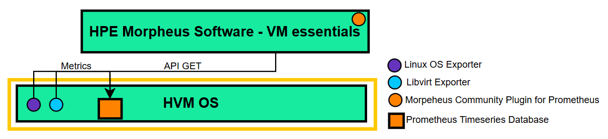

# Prometheus Dashboard Plugin — HPE VM Essentials

A native Morpheus plugin that renders comprehensive telemetry data for HPE Morpheus Software - VM Essentials clusters directly on the **Morpheus Manager dashboard**, with no external dashboarding tool required.

> **Community Plugin — Not Officially Supported by HPE**
>
> This plugins was built by HPE as a community contribution. This is **not** an official HPE product and carries no HPE support, SLA or warranty. You are free to use, fork, and extend this to suit your environment. Pull requests and adaptations are welcome.

---

## Overview

This plugin integrates Linux OS and libvirt telemetry data into the Morpheus Manager UI. All charts are generated **server-side as SVG** and injected into a full-width React widget on the Morpheus Manager home dashboard grid.

| Category         | Metrics                                                                                                      |
| ---------------- | ------------------------------------------------------------------------------------------------------------ |
| Virtual Machines | CPU utilization, memory usage %, storage pool usage, vCPU count, memory allocation, network TX/RX, block I/O |
| HVM hosts        | CPU breakdown, RAM usage, disk space, network throughput, system load, uptime                                |

---

## Features

### Metrics Coverage

- **Instance Info** — CPU utilization, memory usage %, storage pool usage, vCPU count, memory allocation
- **Network Interfaces** — TX/RX traffic, packets, drops, errors (per interface, per VM)
- **Block / Volumes** — Read/write requests and bytes (IOPS)
- **Host System** — 11 stat cards + 4 detailed charts (CPU, memory, network, disk) via Node Exporter

### Flexible Time Ranges

| Range    | Resolution |
| -------- | ---------- |
| 1 hour   | 60 seconds |
| 6 hours  | 5 minutes  |
| 12 hours | 10 minutes |
| 24 hours | 20 minutes |

### Interactive Series Filtering

- Click to hide/show individual series on multi-line charts
- Search box for quick series lookup
- All / None bulk toggle
- Preferences persisted in browser `localStorage` per chart

### Auto-Refresh

- Responds to the Morpheus global dashboard refresh event
- Displays a timestamp of the last successful data fetch
- Graceful error handling with fallback placeholder content

---

## Requirements

- **HPE Morpheus Software - VM Essentials**
- **Prometheus Timeseries Database**
- **Node Exporter** running on the host (for host-level metrics)
- **Libvirt Exporter** running on the host (for VM-level metrics)

---

## Installation

See [INSTALL.md](INSTALL.md) for the full step-by-step guide covering plugin upload, enabling, configuration, and verification.

---

## Architecture

---

## Plugin Details

| Field                   | Value                                                  |
| ----------------------- | ------------------------------------------------------ |
| Plugin class            | `com.morpheusdata.dashboard.PrometheusDashboardPlugin` |
| Plugin code             | `prometheusDashboard`                                  |
| Tested Morpheus version | 8.1.1, 9.0.0                                           |
| Default dashboard       | Yes (enabled out of the box)                           |

For the full list of collected Prometheus metrics see [METRICS.md](METRICS.md).
